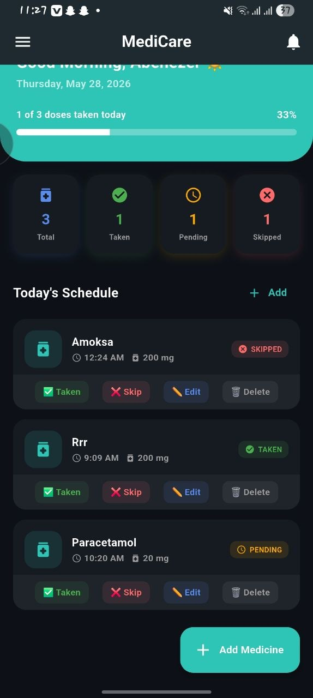
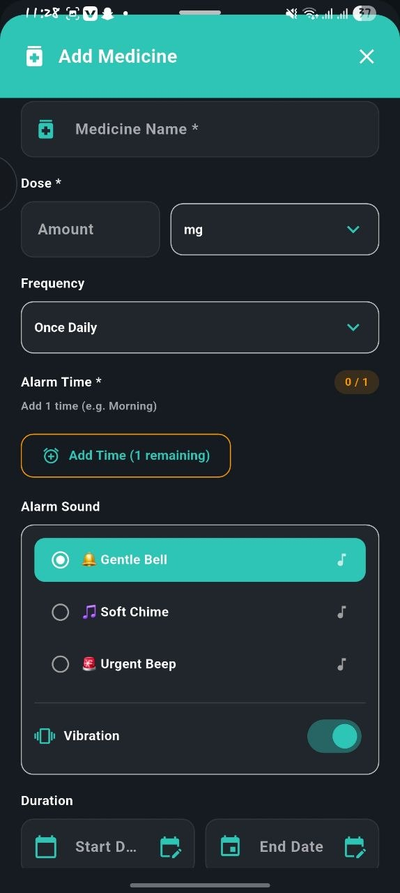
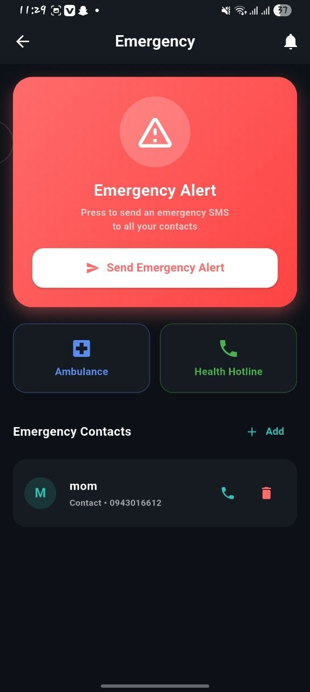

# 💊 Medicare — Smart Health Assistant

<div align="center">


[](https://flutter.dev)
[](https://dart.dev)
[](LICENSE)
[](https://flutter.dev)

**Care You Can Count On.**

</div>

---

## 📖 Overview

**Medicare** is a cross-platform mobile application built with Flutter that empowers users to manage their medications effectively. It combines smart alarm scheduling, health tracking, symptom checking, and emergency management into one clean and intuitive experience.

Developed as part of the **Mobile Application Development** course at **Dire Dawa University**.

---

## ✨ Features

### 💊 Medicine Management
- Add medicines with name, dose, frequency, and start/end dates
- Smart time picker — required alarm slots match selected frequency
- Edit and delete medicines at any time
- Mark medicines as **Taken**, **Skipped**, or **Pending**

### ⏰ Alarm System
- Background alarms that ring even when the app is closed
- 3 built-in alarm sounds: Gentle Bell, Soft Chime, Urgent Beep
- Vibration toggle per medicine
- **Snooze** (10 minutes) and **Stop** controls
- Alarms survive phone restart

### 📊 Health Tracking
- **BMI Calculator** — with category classification (Underweight, Normal, Overweight, Obese)
- **Blood Pressure Calculator** — with 5-stage classification
- Real-time results with color-coded indicators

### 🩺 Symptom Checker
- Quick-tap common symptoms
- Local diagnostic guidance for 8 common conditions
- Medical disclaimer included

### 🚨 Emergency Module
- Add and manage emergency contacts
- One-tap SMS alert to all contacts
- Quick-dial Ambulance and Health Hotline buttons

### 🏥 Pharmacy Finder
- Search nearby pharmacies
- Call and get directions directly from the app
- Open Google Maps integration

### 🌙 Dark Mode
- Full dark mode support across all screens
- Persisted across restarts via Hive

### 👤 User Profile
- Set your name and email
- Personalized greeting on the home screen

### 📈 History & Analytics
- View medicine adherence history
- Filter by status (All, Taken, Pending, Skipped)
- Search medicines by name
- Visual bar chart of adherence

---

## 🛠 Tech Stack

| Technology | Purpose |
|---|---|
| **Flutter 3.41.2** | Cross-platform UI framework |
| **Dart 3.11.0** | Programming language |
| **Hive CE** | Local database & persistence |
| **Provider** | State management |
| **android_alarm_manager_plus** | Background alarm scheduling |
| **flutter_local_notifications** | Heads-up notifications |
| **audioplayers** | Alarm sound playback |
| **url_launcher** | Phone calls, SMS, Maps |
| **fl_chart** | Adherence bar charts |
| **intl** | Date & time formatting |
| **shared_preferences** | Lightweight key-value storage |
| **permission_handler** | Runtime permission requests |

---

## 📱 Screenshots

| Home | Medicines | Alarm Ring |
|---|---|---|
|  |  |  |

| Health | Emergency | Settings |
|---|---|---|
|  |  |  |

> Add screenshots to a `screenshots/` folder in the project root.

---

## 🚀 Getting Started

### Prerequisites

- Flutter SDK `>=3.0.0`
- Android Studio or VS Code
- Android device or emulator (API 21+)
- Git

### Installation

**1. Clone the repository**
```bash
git clone https://github.com/Abenezer-se/medicine-reminder-app.git
cd medicine-reminder-app
```

**2. Install dependencies**
```bash
flutter pub get
```

**3. Run the app**
```bash
flutter run
```

**4. Build release APK**
```bash
flutter build apk --release
```

### ⚠️ Required Phone Settings (Android)

For alarms to work correctly in the background:

| Setting | Path |
|---|---|
| Exact Alarms | Settings → Apps → Medicare → Permissions → Alarms & reminders → **Allow** |
| Battery | Settings → Apps → Medicare → Battery → **Unrestricted** |
| Notifications | Settings → Apps → Medicare → Notifications → **Allow** |

---

## 📁 Project Structure
lib/
├── main.dart                    # App entry point & alarm checker
├── models/
│   ├── medicine.dart            # Medicine Hive model
│   └── emergency_contact.dart   # Emergency contact Hive model
├── providers/
│   ├── medicine_provider.dart   # Medicine CRUD & alarm scheduling
│   ├── emergency_provider.dart  # Emergency contacts management
│   ├── theme_provider.dart      # Dark/light mode state
│   ├── settings_provider.dart   # App settings state
│   └── user_provider.dart       # User profile state
├── services/
│   ├── alarm_service.dart       # Background alarm & notification logic
│   └── notification_service.dart
├── screen/
│   ├── splash_screen.dart       # Launch screen
│   ├── onboarding_screen.dart   # First-time onboarding
│   ├── home_screen.dart         # Dashboard
│   ├── medicines.dart           # Medicines list
│   ├── health_screen.dart       # BMI & blood pressure
│   ├── history_screen.dart      # Medicine history
│   ├── symptom_screen.dart      # Symptom checker
│   ├── emergency_screen.dart    # Emergency contacts
│   ├── pharmacies_screen.dart   # Pharmacy finder
│   ├── setting_screen.dart      # App settings
│   └── alarm_ring_screen.dart   # Full-screen alarm UI
├── widgets/
│   ├── add_medicine_sheet.dart  # Add medicine bottom sheet
│   ├── drawer_widget.dart       # Navigation drawer
│   ├── notification_button.dart # Notification bell
│   └── onboarding_page.dart     # Onboarding slide
└── utils/
└── theme_helper.dart        # Dark/light theme colors
assets/
├── images/
│   └── app_logo.jpg
└── alarm_sounds/
├── gentle_bell.mp3
├── soft_chime.mp3
└── urgent_beep.mp3
test/
├── models/
├── providers/
├── services/
├── screens/
└── widgets/

---

## 🧪 Running Tests

```bash
# Run all tests
flutter test

# Run a specific test file
flutter test test/models/medicine_test.dart

# Run with coverage report
flutter test --coverage
```

**Test coverage includes:**
- Model field defaults and validation
- Provider CRUD operations and Hive persistence
- Dark/light theme switching
- All screen UI elements and interactions
- Symptom checking logic
- BMI and blood pressure calculation accuracy
- Alarm service sound configuration
- Add medicine sheet form validation

---

## 👥 Team

| Name | Student ID | Role |
|---|---|---|
| **Tsion Asrat** | RMD2465 | Project Manager |
| **Sumeya Ahmed** | DDU1600683 | Product Manager |
| **Abenezer Samson** | DDU1600048 | Lead Developer |
| **Enas Remedan** | DDU1600227 | UX/UI Designer |
| **Eyerusalem Berihun** | RMD921 | Quality Assurance |

---

## 🗺 Roadmap

- [x] Medicine management with Hive persistence
- [x] Background alarm system
- [x] Dark mode support
- [x] BMI & blood pressure calculators
- [x] Symptom checker
- [x] Emergency contacts with SMS
- [x] Unit test coverage
- [ ] Real GPS pharmacy search
- [ ] Cloud sync & backup
- [ ] Multi-language support (Amharic, Somali)
- [ ] AI-powered symptom checker
- [ ] Weekly health report PDF export
- [ ] Google Play Store release

---

## 📄 License

This project is licensed under the **MIT License** — see the [LICENSE](LICENSE) file for details.

---

## 🙏 Acknowledgements

- [Flutter](https://flutter.dev) — UI framework
- [Hive CE](https://pub.dev/packages/hive_ce) — Local database
- [fl_chart](https://pub.dev/packages/fl_chart) — Charts
- [android_alarm_manager_plus](https://pub.dev/packages/android_alarm_manager_plus) — Background alarms
- Dire Dawa University — Mobile Application Development course

---

<div align="center">

Made with ❤️ by the Medicare Team — Dire Dawa University

**⭐ Star this repo if you found it helpful!**

</div>